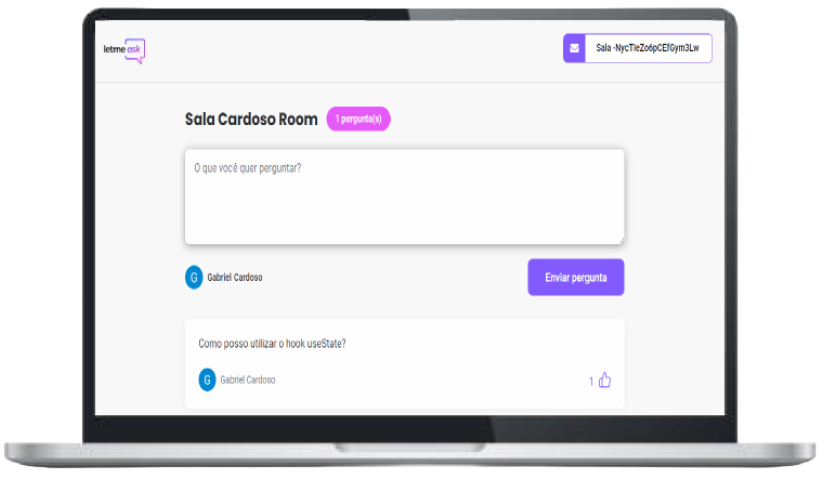

<h1 align="center">
  Letmeask
</h1>

  

## ✨ Tecnologias

Esse projeto foi desenvolvido com as seguintes tecnologias:

- [React](https://react.dev)
- [SCSS](https://sass-lang.com)
- [TypeScript](https://www.typescriptlang.org/)
- [Firebase Authentication](https://firebase.google.com/docs/auth?hl=pt-br)

## 💻 Projeto

O Letmeask é um app que permite a criação de salas com o intuito de tirar dúvidas. Foi utilizado o realtime database do Firebase, além da personalização das regras de alteração de dados por sala dependendo do usuário.

## 🔖 Acesso

[letmeask app](https://letmeask-db1a2.web.app)

## 🚀 Como executar

- Clone o repositório
- Instale as dependências com `npm install`
- Inicie o servidor com `npm start`

Agora você pode acessar [`localhost:3000`](http://localhost:3000) do seu navegador.

---
